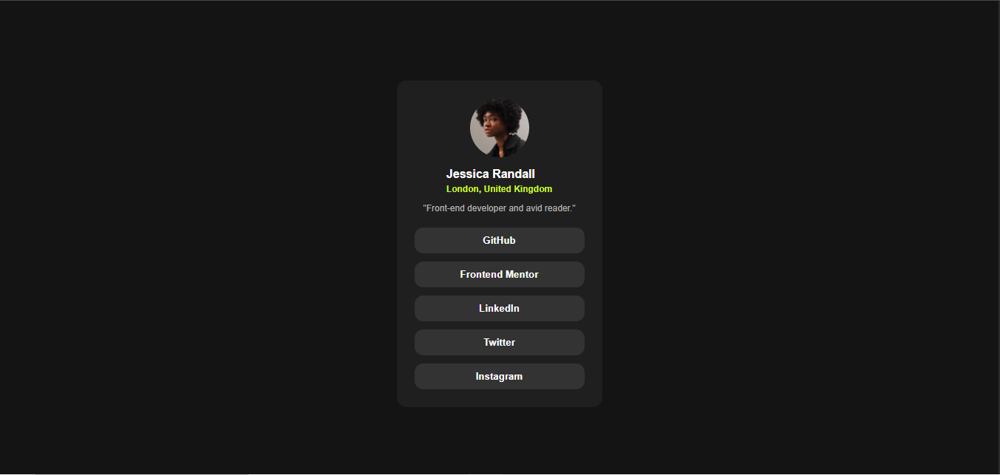
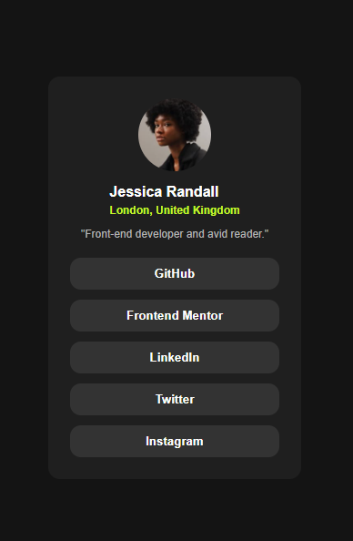

# Social Links Profile

## Overview
A social links profile card from Frontend Mentor where users can share all their social media profiles in one place. Features interactive hover effects and a personalized profile layout.

## Screenshot

### Desktop View

### Mobile View

## Links
- Live Site URL: [sociallinksprofile8654000.netlify.app]
- Solution URL: [https://github.com/Laiba768/Social-links-profile]

## Built with
- HTML5
- CSS3
- Flexbox
- CSS Hover Effects

## What I learned

This challenge was more independent for me compared to my previous projects. I worked through most of the issues on my own, which boosted my confidence significantly.

Key learnings:
- **Creating circular images** using `border-radius: 50%` or high values like `360px`
- **Button hover effects** with `:hover` pseudo-class to change background and text colors
- **Managing gap between nested elements** - I faced challenges with spacing between a div and the two tags inside it, and learned how to properly use `gap` with Flexbox
- **Styling interactive buttons** that respond to user interaction

I'm proud that I completed this challenge more independently than my previous ones. I applied everything I learned from the QR card and Blog card challenges without needing as much guidance.

## Challenges and Solutions

**Challenge 1: Circular Profile Image**
Making the profile image perfectly round required understanding `border-radius`. I set it to a high value or 50% to create the circular effect.

**Challenge 2: Gap Management**
I struggled with spacing between a parent div and its child elements. I solved this by using the `gap` property on the Flexbox container, which cleanly manages spacing between flex items.

**Challenge 3: Hover Effects**
Adding interactive hover states to the social link buttons was new for me. I used the `:hover` pseudo-class to change the background color to the bright green and text color to dark, creating a nice interactive effect.

## Author
- Frontend Mentor - [@LaibaShahzadi]